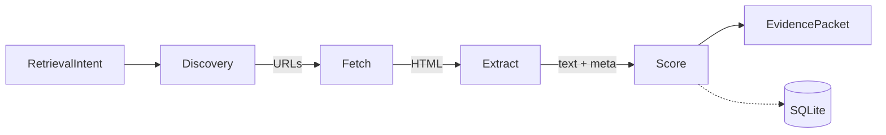

# LiveFetch

Keyless evidence retrieval framework for grounded reasoning systems.

## Overview

LiveFetch provides deterministic, timestamped web evidence for LLM pipelines. It combines discovery, extraction, and multi-factor ranking into a single retrieval primitive that returns structured `EvidencePacket` objects. All discovery sources use **keyless APIs only** - no API keys required.

## Architecture



## Key Features

- **Keyless Discovery**: Reddit, Hacker News, ArXiv, PubMed, Wikipedia, GitHub, Dexscreener, CoinGecko, Yahoo Finance
- **Smart Profiles**: Government, Market, Cooking, Healthcare, Science, Academic, Technical, Social, Legal
- **Advanced Extraction**: PDF, structured data (JSON-LD, microdata, OpenGraph), tables, images
- **Content Analysis**: Language detection, sentiment analysis, NER, summarization, keyword extraction
- **Robust Fetching**: Retry with exponential backoff, circuit breakers, rate limiting, user-agent rotation, proxy support
- **Streaming & Batch**: Async generators for incremental results, parallel query processing
- **Export Formats**: JSON, CSV, Markdown, HTML
- **Performance Monitoring**: Metrics, health checks, cache statistics

## Scoring Model

Documents are ranked by a weighted linear combination:

$S(d|q) = w_r * R + w_f * F + w_t * T - w_dup * D$

| Component | Weight | Description |
|-----------|--------|-------------|
| R (relevance) | 0.55 | Token overlap + fuzzy string similarity |
| F (freshness) | 0.25 | Exponential decay: $2^(-age_days / 7)$ |
| T (trust) | 0.20 | Domain-based prior (.gov=0.9, .edu=0.85, etc.) |
| D (redundancy) | 0.35 | Similarity penalty to already-selected docs |

Weights can be customized per profile.

## Installation

```bash
pip install -r requirements.txt
```

### Optional Dependencies

For advanced features:
```bash
pip install pdfplumber langdetect textblob spacy pandas beautifulsoup4
python -m spacy download en_core_web_sm
```

## Quick Start

```python
from main import LiveFetch, RetrievalIntent

# Simple usage
intent = RetrievalIntent(
    query="EU AI Act enforcement",
    mode="news",
    max_results=5,
    freshness_days=14,
    need_quotes=True
)

with LiveFetch() as lf:
    packets = lf.run_sync(intent)
    for p in packets:
        print(f"{p.title} - {p.domain} (score: {p.score:.3f})")
```

### Using Profiles

```python
# Market profile for crypto/stock data
intent = RetrievalIntent(
    query="ethereum price analysis",
    mode="news",
    profile="market",  # Auto-detects market-related queries
    max_results=10
)

# Government profile for official data
intent = RetrievalIntent(
    query="GDP unemployment data",
    profile="government",  # Forces .gov site searches
    max_results=5
)
```

### Streaming Results

```python
async for packet in lf.run_stream(intent):
    print(f"Received: {packet.title}")
```

### Batch Processing

```python
intents = [
    RetrievalIntent(query="bitcoin news", max_results=5),
    RetrievalIntent(query="ethereum analysis", max_results=5)
]
results = await lf.run_batch(intents)
```

## Data Structures

### RetrievalIntent

| Field | Type | Default | Description |
|-------|------|---------|-------------|
| query | str | required | Search query or RSS URL |
| mode | Literal | "news" | Discovery mode: web, news, rss |
| max_results | int | 8 | Max packets returned |
| freshness_days | int | 14 | Hard filter cutoff (None=disabled) |
| need_quotes | bool | True | Extract quotable sentences |
| allow_domains | List[str] | None | Whitelist filter |
| deny_domains | List[str] | None | Blacklist filter |
| profile | str | None | Profile name (auto-detected if None) |
| auto_detect_profile | bool | True | Auto-detect profile from query |
| progress_callback | Callable | None | Progress updates (stage, current, total) |
| content_types | List[str] | None | Filter by MIME type |
| languages | List[str] | None | Filter by language code |
| need_summary | bool | False | Generate extractive summary |
| extract_entities | bool | False | Extract named entities (requires spaCy) |
| extract_keywords | bool | False | Extract keywords |
| analyze_sentiment | bool | False | Analyze sentiment (requires TextBlob) |
| extract_images | bool | False | Extract image URLs and alt text |
| extract_tables | bool | False | Extract HTML tables (requires pandas) |
| extract_structured_data | bool | False | Extract JSON-LD, microdata, OpenGraph |

### EvidencePacket

| Field | Type | Description |
|-------|------|-------------|
| url | str | Canonical source URL |
| domain | str | Extracted domain |
| title | str | Page title |
| text | str | Extracted content (clipped to 12k chars) |
| published_at | datetime | Publication timestamp |
| fetched_at | datetime | Retrieval timestamp (UTC) |
| mode | str | Discovery mode used |
| score | float | Composite ranking score |
| score_breakdown | Dict | Individual R/F/T/D components |
| content_sha256 | str | Content hash for deduplication |
| quotes | List[str] | Key sentences for citation |
| metadata | Dict | Structured data, market data, custom extractor results |
| images | List[Dict] | Image URLs with alt text |
| tables | List[Dict] | Extracted table data |
| language | str | Detected language code |
| content_type | str | MIME type |
| sentiment | float | Sentiment polarity (-1 to 1) |
| summary | str | Extractive summary |

## Profiles

Profiles modify queries, filter domains, and adjust scoring weights:

### Available Profiles

- **government**: Official data, .gov sites, PDFs
- **market**: Crypto/stocks, Dexscreener, CoinGecko, Yahoo Finance
- **cooking**: Recipe sites, food blogs
- **healthcare**: Medical sites, WHO, CDC, NIH
- **science**: Research papers, ArXiv, PubMed, .edu sites
- **academic**: Scholarly sources, research papers
- **technical**: GitHub, Stack Overflow, documentation
- **social**: Reddit, Hacker News, forums
- **legal**: Court documents, legal databases

### Profile Features

- **Query Modification**: Adds Google dorking syntax (e.g., `site:.gov`)
- **Domain Filtering**: Allows/denies specific domains
- **Scoring Weights**: Custom relevance/freshness/trust weights
- **Trust Boost**: Multiplier for domain trust scores

## Discovery Sources

### Keyless APIs

- **Reddit**: `/r/{subreddit}/search.json` (public JSON API)
- **Hacker News**: `hn.algolia.com/api/v1/search` (Algolia API)
- **ArXiv**: `export.arxiv.org/api/query` (public API)
- **PubMed**: `eutils.ncbi.nlm.nih.gov` (E-utilities API)
- **Wikipedia**: `en.wikipedia.org/w/api.php` (MediaWiki API)
- **GitHub**: `api.github.com/search/repositories` (public API)
- **Dexscreener**: `api.dexscreener.com` (public API, 300 req/min)
- **CoinGecko**: `api.coingecko.com/api/v3` (public API, rate-limited)
- **Yahoo Finance**: `query1.finance.yahoo.com/v1/finance/search` (public API)

### Web Search

- **DuckDuckGo**: Fallback for general web/news search (via `ddgs`)

### RSS Feeds

- Direct RSS/Atom feed parsing via `feedparser`

## Extraction Pipeline

1. **trafilatura** (primary) - fast mode extraction
2. **newspaper3k** (fallback) - also provides publish date inference
3. **readability-lxml** (tertiary) - boilerplate removal + trafilatura cleanup
4. **pdfplumber** (PDFs) - text extraction from PDF documents
5. **BeautifulSoup4** (structured data) - JSON-LD, microdata, OpenGraph
6. **pandas** (tables) - HTML table to structured data conversion

## Advanced Features

### Retry Logic

- Exponential backoff with jitter
- Circuit breaker (opens after N failures, closes after timeout)
- Configurable via `LFConfig`:
  - `max_retries`: Number of retry attempts
  - `backoff_base`: Base for exponential backoff
  - `backoff_max`: Maximum backoff time
  - `jitter`: Add randomness to backoff
  - `circuit_breaker_threshold`: Failures before opening circuit
  - `circuit_breaker_timeout`: Time before circuit closes

### Rate Limiting

- Per-domain rate limiting
- Configurable via `LFConfig`:
  - `rate_limit_per_domain`: Dict mapping domain to requests/second
  - `default_rate_limit`: Default rate limit for unknown domains

### User-Agent Rotation

- Rotates user agents to avoid blocks
- Configure via `LFConfig.user_agents` list

### Proxy Support

- HTTP/SOCKS5 proxy support
- Proxy rotation
- Configure via `LFConfig.proxy` or `LFConfig.proxy_rotation`

### Caching

SQLite with WAL mode. Schema:

```sql
CREATE TABLE docs (
    url TEXT PRIMARY KEY,
    content_sha256 TEXT,
    fetched_at TEXT,
    published_at TEXT,
    title TEXT,
    text TEXT,
    expires_at TEXT
);
```

**Features:**
- TTL-based expiration (`cache_ttl_days`)
- Cache statistics (`get_cache_stats()`)
- Warm cache (`warm_cache()`) - pre-fetch expiring URLs
- Automatic cleanup of expired entries

### Content Analysis

- **Language Detection**: `langdetect` (ISO 639-1 codes)
- **Sentiment Analysis**: `TextBlob` (polarity -1 to 1)
- **Named Entity Recognition**: `spaCy` (PERSON, ORG, GPE, DATE)
- **Summarization**: Extractive summarization (top sentences by word frequency)
- **Keyword Extraction**: Most frequent meaningful words

### Export Formats

```python
# JSON
json_output = lf.export_to_json(packets)

# CSV
csv_output = lf.export_to_csv(packets)

# Markdown
md_output = lf.export_to_markdown(packets)

# HTML
html_output = lf.export_to_html(packets)
```

### Performance Metrics

```python
metrics = lf.get_metrics()
# Returns: requests, success, failures, success_rate, avg_latency, 
#          cache_hits, cache_misses, cache_hit_rate
```

### Health Checks

```python
health = lf.health_check()
# Returns: {"cache": bool, "discovery": bool}
```

## Configuration

### LFConfig

Centralized configuration class:

```python
from main import LFConfig, LiveFetch

config = LFConfig(
    cache_path="livefetch.sqlite",
    max_results=10,
    max_concurrency=6,
    timeout_seconds=15.0,
    max_chars=12000,
    freshness_half_life=7.0,
    min_text_length=200,
    min_score=0.0,
    weights={"relevance": 0.55, "freshness": 0.25, "trust": 0.20, "redundancy": 0.35},
    user_agent="Mozilla/5.0...",
    max_retries=3,
    backoff_base=2.0,
    backoff_max=60.0,
    jitter=True,
    circuit_breaker_threshold=5,
    circuit_breaker_timeout=300.0,
    rate_limit_per_domain={"example.com": 1.0},
    default_rate_limit=2.0,
    user_agents=["UA1", "UA2"],
    proxy="http://proxy:8080",
    proxy_rotation=["proxy1", "proxy2"],
    cache_ttl_days=7,
    max_file_size=10_000_000,
    extractors=[custom_extractor_function]
)

lf = LiveFetch(config=config)
```

### Convenience Function

```python
from main import fetch

packets = fetch("bitcoin price news", profile="market", max_results=10)
```

## CLI Tool

```bash
python cli.py "query" --mode news --max-results 10 --profile market --export json
```

Options:
- `--mode`: web, news, or rss
- `--max-results`: Number of results
- `--freshness-days`: Filter by age
- `--profile`: Profile name
- `--export`: json, csv, markdown, or html
- `--output`: Output file path

## LLM Integration

LiveFetch is designed for LLM pipelines. See `LLM_INTEGRATION.md` for detailed examples.

### Example: CRCAAgent

```python
from main import LiveFetch, RetrievalIntent
from CRCA import CRCAAgent

lf = LiveFetch()
intent = RetrievalIntent(
    query="Ukraine war latest news",
    mode="news",
    max_results=8,
    need_quotes=True
)
packets = lf.run_sync(intent)

# Format evidence for LLM
evidence = "\n\n".join([f"**{p.title}**\n{p.text[:500]}" for p in packets])

# Use with CRCAAgent
agent = CRCAAgent(model_name="gpt-4o-mini", max_loops=3, agent_max_loops=3)
result = agent.run(task=f"Analyze this evidence: {evidence}")
```

See `crca_agent_example.py` and `swarms_agent_example.py` for complete examples.

## Dependencies

### Core
- `ddgs` (DuckDuckGo search)
- `httpx` (async HTTP)
- `trafilatura`, `newspaper3k`, `readability-lxml` (extraction)
- `rapidfuzz` (similarity)
- `tldextract` (domain parsing)
- `feedparser` (RSS)
- `loguru` (logging)

### Optional
- `pdfplumber` (PDF extraction)
- `langdetect` (language detection)
- `textblob` (sentiment analysis)
- `spacy` (NER, requires `en_core_web_sm` model)
- `pandas` (table extraction)
- `beautifulsoup4` (HTML parsing, structured data)
- `click` (CLI)

## Backward Compatibility

Old class names are aliased:
- `LiveFetch` → `LF`
- `RetrievalIntent` → `RIntent`
- `EvidencePacket` → `EPacket`
- `LiveFetchConfig` → `LFConfig`

## License

See LICENSE file.
